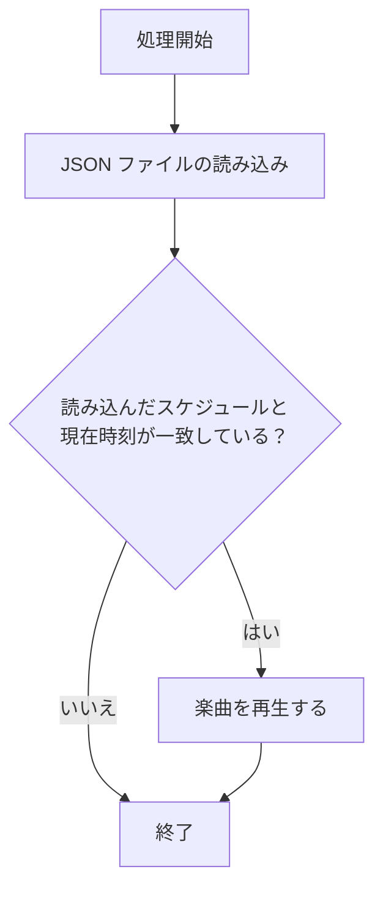

<!--
title:   Raspi に時報機能を作ったら時間の意識ができるのでは？！
tags:    Python3,RaspberryPi
id:      b1add8413bbe97cfa14c
private: true
-->
# Raspi に時報機能を作ったら時間の意識ができるのでは？！

はじめまして！福原です！

最近、在宅ワークが増えてほぼ家にいる生活を送っており、時間感覚が曖昧になってきてまして...
1時間毎にお知らせしてくれる何かがあればいいのでは！と思い至ったので、どんなことをしたのかを記事にしていこうと思います！

今回の作成物は[GitHub](https://github.com/coresync-fukuhara/time-announcement-backend) においていますので、ご興味がある方は覗いて見てください :eyes:

# 機能要件

まず、欲しい機能要件としては

1. **毎時00分に20～30秒くらいの曲を流してくれる**
    長すぎず短すぎずがいいのかなぁと
2. **Raspi 上で完結している**
    Raspi サーバーを別途作成しているのでその上にデプロイしたい
3. **鳴らしたい時間を設定できる**
    夜中に鳴らされても困ってしまう

その他要件として現在業務でPython を使用しているのでPython にて開発をしていきます

ざっと要件が決まったので調査に入っていきたいと思います

# 調査

調査をするにあたって、まずは何を調査しないといけないのか噛み砕いていこうと思います

機能要件の1 の曲の長さについては今回は20秒～30秒の曲を使用することで調整することとします
2 については動作環境がRaspi となるので考慮を忘れないようにしていきます
3 については **決まった時間に実行する** と **曲を流す機能** になります

いい感じに噛み砕けたのでそれぞれについて調査していきましょう！

## Raspi で曲を流すには 出力デバイス編

まず考えないといけないのは **出力デバイスをどうするか** になります
現在の自分がぱっと思いつく手段として、**Raspi にイヤホンジャックにスピーカーを繋ぐ**のか、**I2C で何かしらの方法でスピーカーを繋ぐ**か...
Bluetooth スピーカーやHDMI 経由でディスプレイからもありますが、Raspi の出力を選択するだけなのでイヤホンジャックにスピーカーを繋ぐ方法と同じと考えます

音を鳴らしてくれる物は絞れたので、これらを実際に使うにはどうするかを見ていきましょう

### イヤホンジャック 接続のスピーカーから曲を流す

こちらの手法は簡単で、Raspi から音声出力をイヤホンジャックに設定するだけで可能になります！

メリット

- 設定が簡単

デメリット

- ただスピーカーを繋げるだけで簡単...

### I2C 接続のスピーカーから曲を流す

調査して分かったこととして、I2C は通信目的で使用するため、データの送信ではなくスピーカーの制御等を行う物でした
I2C ではなく、GPIO を使用すればスピーカーで音を流せそうなので調査を**GPIO 接続のスピーカーから曲を流す**へ変更して継続していこうと思います！

### GPIO 接続のスピーカーから曲を流す

**PWM (Pulse Width Modulation)** を利用することでスピーカーから流すことができるとのことです
PWM とはなんだ？と思いますが、**デジタルの世界**では「0」「1」で値をやり取りしますが、**アナログの世界**では「0」「1」の他に 「0.5」や「0.01」等、たくさんの値を使用します
どうにかして**デジタルからアナログを表現**させたいとのことで生まれた手法の1つです
原理としては「0」「1」を一定周期で変化させて、1周期の平均を取ることで**疑似的にアナログを表現**させます
具体例を挙げると「0」「1」を 1:1 の割合で変化させてあげると「0.5」になります
このPWM を使用して曲の**デジタルデータ**をスピーカーが認識できる **\(疑似\)アナログデータ**へ変換させて曲を流すというのがこの手法になります

メリット

- 少し複雑で面白そう

デメリット

- 複雑な楽曲や複数の音を正確に再生するには向いていない
- PWM の特性上、高音質の音源を流せない
- 上記を解決するのに別の技術が必要

### まとめ

GPIO 接続で曲を流す手法は面白さはあるものの、思っていたよりも**低レイヤー**の話になってきて今の知識では沼にハマりそう + 作るのに結構お金がかかりそうな気がしたので、今回はあきらめて**イヤホンジャック接続**で曲を流そうと思います。。。

## 音源ファイル形式

出力デバイスが決まったら次に考えるのはどのように曲を再生するかを決めないといけませんね！
その中でまずどんな形式を扱うかを決めていきたいと思います

軽く調べただけでもWAV やMP3、AAC 等色々とありますが、いくつか絞って特徴を見ていきましょう！

### WAV

WAV の特徴としては音源を圧縮していないので高音質ですが、ファイルサイズが大きくなってしまう欠点があります
また、圧縮をしていない関係なのかPython で標準サポートされており、扱いやすい利点もあります
今回は20～30秒の曲で曲数も5曲程度と考えているのでファイルサイズに関しては気にしなくていいかもしれませんね

### MP3

MP3 はWAV の反対で音源を圧縮しており音質劣化が起こってしまいますが、その分ファイルサイズが小さい利点があります
圧縮している関係でPython での標準サポートが無く、少し扱いづらい欠点が...

### AAC

AAC はMP3 より高圧縮でありながら音質も高いという優れモノになっています
YouTube やiTunes などのストリーミングサービスでも使われているとか
扱いやすさはMP3 と同様、Python での標準サポートがないため少し扱いづらい...

### まとめ

今回は扱いやすさを考え、WAV 形式の音源ファイルを採用しようと思います！

## Raspi で決まった時間にプログラムを実行する

事前知識としてcron を知っていますが、他にも実現できるものが無いか調査していきます！

### cron

まずは先程登場したcron についてです
そもそもcron ってなに？となる方もいると思いますので軽く解説します

cron は定期的にコマンドやスクリプトを自動で実行してくれる機能
例として、`毎日9時にコマンドを実行する` や `5秒毎にコマンドを実行する` 等の設定ができます
ただし、より細かい設定を一括で行うことはできず、今回の様な決まった時間に実行させる場合は、毎時スクリプトの起動はするが、本処理はスクリプトの中で判断する等の工夫が必要になります

メリット

- 設定が簡単

デメリット

- ログ管理が難しく、トラブルシューティングが大変になる可能性がある

### systemd

Linux を愛用している方ならおなじみの `systemd` ですが、タイマーユニットという物を使うとcron と同じことをさせることがみたいです！
使い方としてはサービスファイルの他にタイマーファイルを一緒に定義してあげることで、定義したサービスを定期実行させてくれるみたいです！

<details>
<summary>設定例</summary>

毎時00分にhoge.sh を実行してくれる例になります

```systemd:sample.service
[Unit]
Description=サンプル

[Service]
Type=oneshot
ExecStart=/home/hoge/hoge.sh
```

```systemd: sample.timer
[Unit]
Description=サンプル定期実行

[Timer]
OnCalendar=*-*-* *:00:00
Persistent=false

[Install]
WantedBy=timers.target
```

</details>

メリット

- サービス単位で管理できるので扱いやすい

デメリット

- 管理するファイルが増える

### 機能内で定期実行させる

言われてみれば一番最初に思いつくのはこれ！っていうのを忘れていましたw
無限ループさせて定期的に実行させれば同じことができますね！

メリット

- 1つのサービスで完結する

デメリット

- 大した意味もなく、常に動いているサービスが増える
- プロセスが落ちたときに自動復旧しづらく、ログや監視の仕組みも自前で用意する必要がある

### まとめ

今回はcron を採用してちゃちゃっと仕上げる方向で作っていこうと思います！
ただ、鳴らしたい時間を変更するたびにcron を編集するのも嫌なので、別途json にて時刻設定を行いたいと思います
イメージとしては、｢cron で毎時00分にスクリプトを起動させ、スクリプトの中で時間設定用のファイルを読み込み、設定されている時刻かを判断して曲を鳴らすかどうかを決める｣ といった感じになります

## ライブラリの選定

これまでの調査から **WAV ファイル** と **json ファイル** を扱う方針となっていますので、ここからはこれらをどうやったらPython で扱えるようになるかを考えていきましょう！

### WAV ファイルの扱い

まずはWAV ファイルを扱う方法から考えていきたいと思い、いくつかのライブラリに絞ってまとめていきます

#### wave

まずはPython 標準ライブラリとなっているwave になります

メリット
- Python 標準ライブラリで追加の依存なしでデータの読み書きができる
- 簡易な入出力には最適

デメリット
- 音声に処理をしたい場合、バイナリデータをNumPy 等へ変換しないといけない

#### scipy

メリット
- NumPy としての音声データの処理がやりやすい
- 研究での利用例が多く、拡張性が高い

デメリット
- WAV 以外のフォーマットは別のツールで行うことが多い

#### pydub

メリット
- WAV だけでなくMP3 等も扱うことができる

デメリット
- FFmpeg のインストールが必須となり、初期設定が必要

#### まとめ

今後の拡張を考え、今回は`scipy`を採用していきたいと思います

### WAV の再生

次は`scipy`で読み込んだWAV を再生してくれるライブラリを探していこうと思います
scipy でWAV を読み込むと`NumPy 配列`でデータが扱われることに注意して調査していきます！

#### sounddevice

メリット
- NumPy 配列のまま再生可能
- 記述がシンプル

デメリット
- 複数サウンドの重複再生不可
- 環境によってはセットアップに手間がかかる

#### PyAudio

メリット
- NumPy 配列で再生可能
- ストリーム制御が細かく可能

デメリット
- 記述量が少し多い
- ストリームの設定･終了処理が必要

#### playsoud

メリット
- ファイルパスの指定だけで再生可能

デメリット
- NumPy 配列での再生は不可

#### まとめ

複数サウンドを同時に再生できなくてもよく、シンプルに書きたいので、今回は`sounddevice`を採用したいと思います。

### json ファイルの扱い

json ファイルに関しては組み込み関数の`open`を使用してファイルを読み取り、標準ライブラリの`json`を使用してJSON をDict へ変換して扱いたいと思います

# 設計

調査にて大まかな方針が決まったのでここからは設計に移っていきます！
ざっくりとした流れは ①スケジュールの読み込み → ②楽曲再生の可否 → ③楽曲の再生 となります
これを簡単にフローチャートに起こし、json の構造を決めていきたいと思います！

## フローチャート



## json 構造

> 今回はcron を採用してちゃちゃっと仕上げる方向で作っていこうと思います！
ただ、鳴らしたい時間を変更するたびにcron を編集するのも嫌なので、別途json にて時刻設定を行いたいと思います

途中でちらっと登場した｢json での時刻設定｣を行うためにjson のスキーマを考えていきたいと思います

やりたいことを実現するだけなら「鳴らしたい時間だけが入った単純な配列」でも足りますが、それだと将来「曜日ごとに時間を変えたい」「時間ごとに別の設定を持たせたい」となったときにスキーマを作り直す必要が出てきます。
そこで、今回は少しリッチではありますが **曜日ごとに時間設定を持てる拡張性のあるスキーマ** にしておきます。

<details>
<summary>json スキーマ</summary>

```json
{
  "$schema": "http://json-schema.org/draft-07/schema#",
  "title": "weekly_schedule",
  "description": "各曜日の時間設定",
  "type": "array",
  "items": {
    "type": "array",
    "title": "hour_settings",
    "description": "時間毎の設定",
    "items": {
      "type": "object",
      "properties": {
        "hour": {
          "type": "number",
          "title": "hour",
          "description": "時間 (0-23)"
        }
      },
      "required": ["hour"]
    }
  }
}
```

</details>

<details>
<summary>json 例</summary>

平日9時･10時に鳴らす

```json
[
  [],
  [
    {
      "hour": 9
    },
    {
      "hour": 10
    }
  ],
  [
    {
      "hour": 9
    },
    {
      "hour": 10
    }
  ],
  [
    {
      "hour": 9
    },
    {
      "hour": 10
    }
  ],
  [
    {
      "hour": 9
    },
    {
      "hour": 10
    }
  ],
  [
    {
      "hour": 9
    },
    {
      "hour": 10
    }
  ],
  []
]

```

</details>


# 実装

それでは必要な材料が揃ったので実装していきましょう！
※mypy を使用して静的解析を行っている為、適宜型付けを行っています。

## 音源の再生

音源ファイルの読み込みはscipy を使用し、その読み込んだ音源をsounddevice を使用して再生していきます。
今回の実装では複数の音源ファイルをランダムで選ばれるように実装してみました。

実装例

```python: play_sound.py
import glob
import os
import random

from scipy.io import wavfile
import sounddevice as sd


BASE_DIR = os.path.dirname(os.path.dirname(os.path.abspath(__file__)))
SOUND_PATH = os.path.join(BASE_DIR, "sounds")


def play_sound() -> None:
    # 楽曲の一覧を取得する
    files = glob.glob(f"{SOUND_PATH}/*.wav")

    # ランダムに楽曲を選択して読み込む
    fs, data = wavfile.read(random.choice(files))

    # 音声を再生する
    sd.play(data, fs)
    sd.wait()
```

## スケジュールの読み込み

スケジュールを読み込む前にまずはスケジュール用の型を作成しておきます。
今回の型定義はPython の組み込み関数の`typing`を使用して行います。

<details>
<summary>型定義例</summary>
`python: schedules_models.py
from typing import List, TypedDict


class HourlyScheduleItemType(TypedDict):
    hour: int


DailyScheduleType = List[HourlyScheduleItemType]
WeeklyScheduleType = List[DailyScheduleType]
</details>

型定義が完了したら実際に実装していきます。
今回はPython 組み込み関数の`json`を使用してスケジュール設定したJSON ファイルを読み込ませていきます！

実装例

```python: load_schedule.py
import json

from schedules_models import WeeklyScheduleType


def load_schedule(path: str) -> WeeklyScheduleType:
    # スケジュールを読み込む
    with open(path, encoding="utf-8") as f:
        try:
            data = json.load(f)
            schedules: WeeklyScheduleType = data

        except json.JSONDecodeError:
            # 読み込みに失敗した場合は空のスケジュールを返す
            return []

        return schedules
```

## 音源の再生判定

上記からスケジュールの読み込みができるようになったので、読み込んだスケジュールから音源を再生するかを判定できるようにしていきます！


実装例

```python: should_run.py
import datetime
from zoneinfo import ZoneInfo


def should_run(schedule: WeeklyScheduleType, now: datetime.datetime) -> bool:
    # 曜日を取得する (0=月曜, 6=日曜)
    weekday = now.weekday() % 7
    # 今日のスケジュールを取得する
    today_schedule = schedule[weekday]
    # 現在の時刻を取得する
    hour = now.hour
    minute = now.minute

    # 現在の時刻に対応する設定を取得する
    hour_settings = next((s for s in today_schedule if s["hour"] == hour), None)

    # 設定が存在しない場合は実行しない
    if hour_settings is None:
        return False

    # 分が0分でない場合は実行しない
    if minute != 0:
        return False

    return True
```

## 結合

上記にて作成したパーツ (関数) を組み合わせて今回の機能としていきます！

```python: main.py
import datetime
import os
from zoneinfo import ZoneInfo

from load_schedule import load_schedule
from play_sound import play_sound
from should_run import should_run


BASE_DIR = os.path.dirname(os.path.dirname(os.path.abspath(__file__)))
SCHEDULE_PATH = os.path.join(BASE_DIR, "settings/schedules.json")


def main() -> None:
    # 現在時刻を取得する
    now = datetime.datetime.now(ZoneInfo("Asia/Tokyo"))
    # スケジュールを読み込む
    schedule = load_schedule(SCHEDULE_PATH)
    # スケジュールに基づいて音を鳴らすか判定する
    if should_run(schedule, now):
        # 曲を再生する
        play_sound()


if __name__ == "__main__":
    main()
```

# デプロイ

長い道のりをようやくここまでやってきました！
最後は今まで作成したものをデプロイして動かせるようにしていきましょう！

## 必要なライブラリのインストール

今回はまっさらな状態のRaspberry Pi OS からセットアップできるように必要なライブラリをインストールしていきます。

```bash
sudo apt update
sudo apt install -y python3 python3-pip python3-dev python3-numpy \
libasound2-dev libportaudio2 portaudio19-dev libffi-dev build-essential
# ソースをgit clone する場合はgit もインストールすること
# sudo apt install -y git

python3 -m pip install --upgrade pip
python3 -m pip install sounddevice scipy
```

## 音声出力設定

今回は3.5mm のジャックから音を出したいので`raspi-config`を使用して明示的に設定しておきます。

以下のコマンドを実行して設定画面を開きます。

```bash
sudo raspi-config
```

画面表示後、`1 System Options`を選択します。


次に変更するオプションを選択するため、`S2 Audio`を選択します。


オーディオの選択画面が表示されたら音声出力させたいデバイスを選択します。
今回はHDMI に接続していないのでHeadphones (3.5mm ジャック) しか選択できません。


最初の画面に戻ってきたら`Finish`を選択して設定を終了します。


## ソースのコピー

まだRaspi 上にソースがない想定なので、ソースをRaspi 上の好きなパスへコピーしてください。
コピーしたパスは次で使用するため、必ず覚えておいてください！

## cron の設定

それでは最後に定期的に実行できるようにcron の設定をしていきます！

Raspi 上で以下のコマンドを実行してください。

```bash
crontab -e
```

以下の画面 (ファイル) が開かれたら編集していきます。
※ vi で開かれているため操作方法に関しては[チートシート](https://gihyo.jp/assets/files/magazine/SD/2015/201510/download/Furoku_CheatSheet_Vim.pdf)を参考にしてみてください。

追記する内容は以下の通りです。

```cron
*/5 * * * * /usr/bin/python3 /your_path/time-announcement/src/main.py
```

上記追記した後のcrontab は以下の通りです。


後は設定した時間になれば時報機能が有効になります！

# まとめ

これにて時報機能の作成･デプロイは以上になります！
使用するライブラリや音源ファイルの選定など、今回は「まず動くものをシンプルに作る」ことを重視しましたが、拡張しやすい設計も意識して作ってみました。


# 感想

作れるのは分かっていたけど、無事に完成してよかったぁ... :tada:
実際に稼働させて1時間経ったのを教えてくれる \"何か\" があると、嫌でも時間の意識をさせられるので ｢もうこんな時間なのか...｣ が減り、生活リズムが整った感じがしています！
今後の展望ですが、始業･就業を知らせてくれる機能も欲しいと感じたので毎時00分だけでなく、分も指定させられるできるように拡張するのと、時間によって決まった曲が流せたら良いなと思ったので **決まった時刻に決まった曲を流す機能** を追加していきたいと思います！ :muscle: